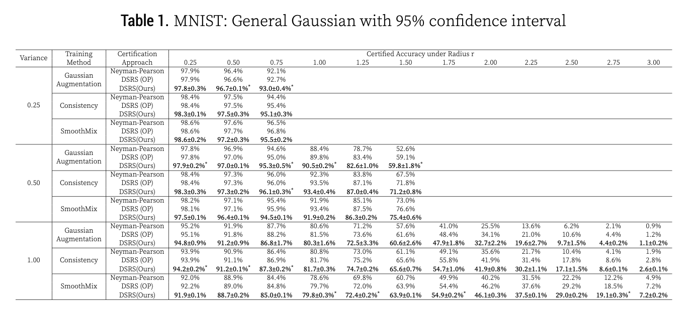
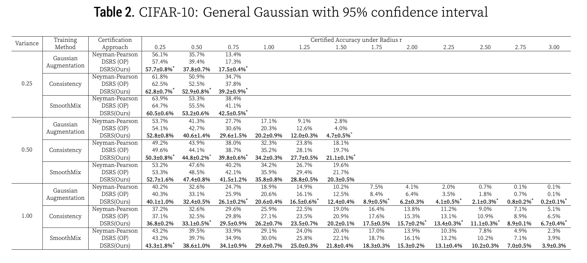

# [Re] Double Sampling Randomized Smoothing

[](https://opensource.org/licenses/BSD-3-Clause)

This repository is the official implementation of [Re]Double Sampling Randomized Smoothing. We aim to reproduce the results and validate the methods proposed in [Double Sampling Randomized Smoothing](https://arxiv.org/abs/2206.07912).

Double sampling randomized smoothing (DSRS) is a novel robustness certification framework for randomized smoothing. 

Given an input instance and a model, robustness certification approach computes a robust radius, such that any perturbations within the radius does not the change the final prediction. By nature, certification approach is conservative --- it provides a lower bound of robust radius while the maximum robust radius for the given input instance could be much larger than the one computed by the certification approach.

For RS, the most widely-used certification approach is called Neyman-Pearson-based certfication. It leverages the probability of base model's predicting each class under the input noise to compute the certification.

In the paper **Double Sampling Randomized Smoothing**, the authors propose to sample the base model's prediction statistics under **two different distributions**, and leverage the joint information to compute the certification. Since we leverage more information, our certification approach is guaranteed to be tighter (if not equal) than the most widely-used Neyman-Pearson-based approach.


(Above description is taken from official repo [DSRS](https://github.com/llylly/DSRS))

## Requirements

To run the Certification, first create a conda environment :

```setup
conda env create -f environment.yaml
```
For activating dsrs environment,
```
conda activate dsrs
```

## Training and Certification

### Original Results
To train and certify a model under a particular variance(0.25, 0.5, 1.0) and a particular training method (Gaussian, Consistency, Smoothmix), select an appropriate file from ```bash scripts main results``` folder and move it to the main directory using the command
```
mv <selected-file>.sh ../
```
After that you can run the file using the command 
```
bash <selected-file>.sh
```
For specific changes in the hyperparameters, you can refer the main repo and make changes to the ```<selected-file>.sh```. For more information refer to the [readme-DSRS](https://github.com/llylly/DSRS/blob/master/README.md)

### Results Under Ablations
To train and certify a model under a particular ablation type, select an appropriate file from ```bash scripts main results``` folder and move it to the main directory using the command
```
mv <selected-file>.sh ../
```
After that you can run the file using the command 
```
bash <selected-file>.sh
```
For some files you can change the sampling number N , the hyperparameter K(general-gaussian), and sigma pf P and Q distributions and run the model on Standardized Gaussian.

For specific changes in the hyperparameters, you can refer the main repo and make changes to the ```<selected-file>.sh```. For more information refer to the [readme-DSRS](https://github.com/llylly/DSRS/blob/master/README.md)

## Evaluation

To evaluate and get results of the certification, run:

```
python dump_main_results.py
```
To run and get results for the ablations, you can alter this file to get the main results as per your need.

Usage: `python dump_main_result.py`
It will create `result/` folder and dump all main tables and figures there. Some critical results are also printed in stdout.

## Pre-trained Models

We have provided the pretrained models that are available in `dsrs/hamare_models` directory. You can also find the adversarially trained models in `dsrs/hamare_models_adv` folder.


## Results

Our experiments on Certification achieves the following results:

### MNIST Results


### CIFAR-10 Results


## Contributing

You can reach us for any information about the ablation experiments and the results. The above code is locensed under [BSD license](https://opensource.org/licenses/BSD-3-Clause) as the main paper.
